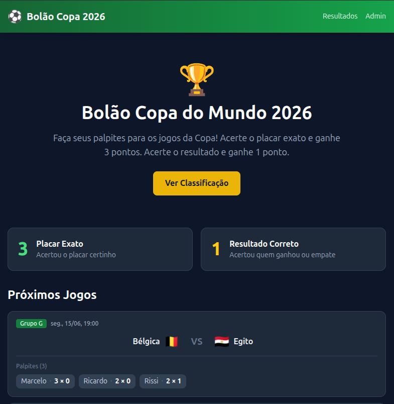
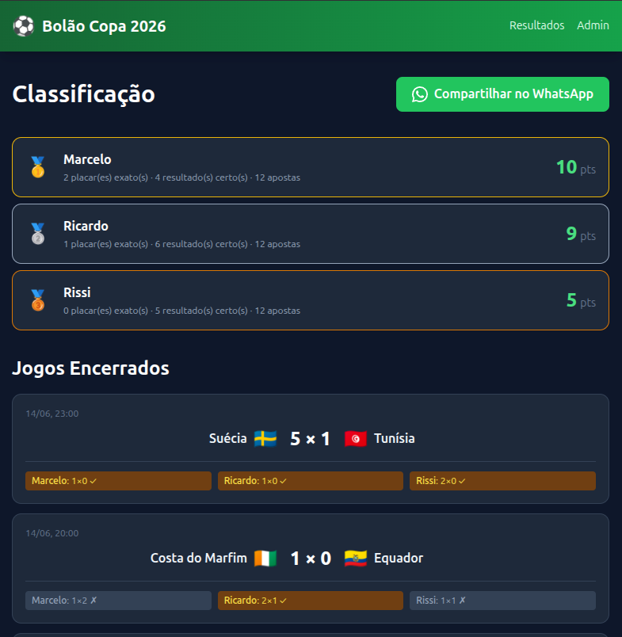
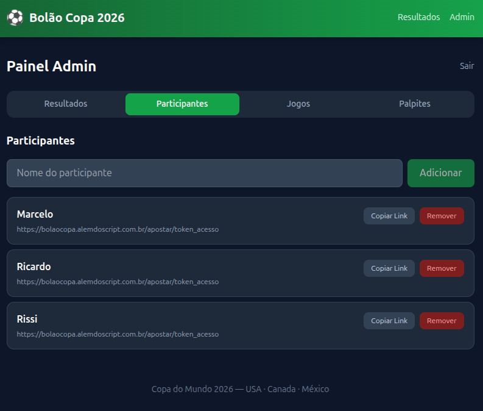
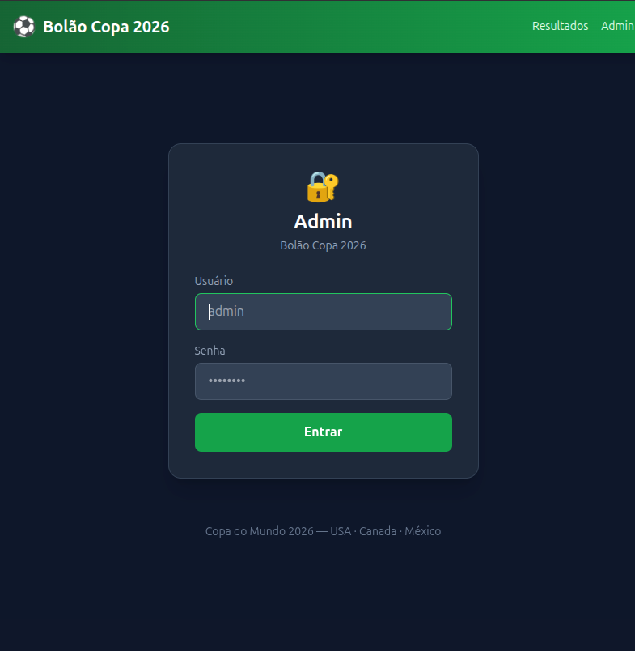
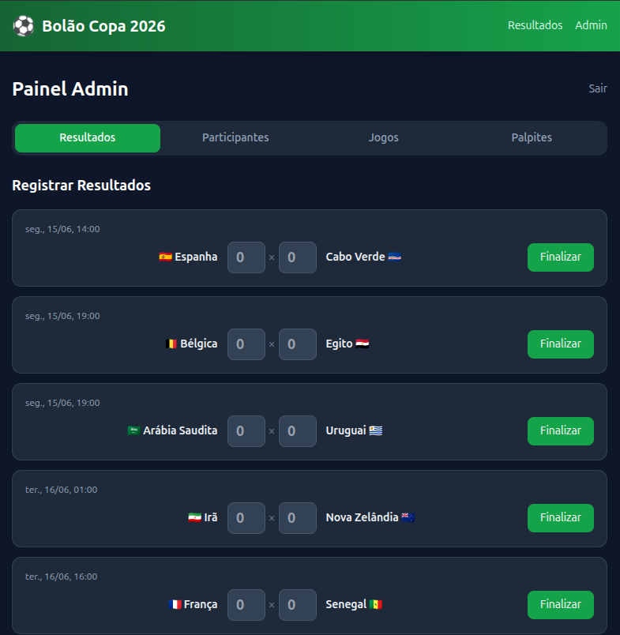

# Bolao Copa 2026

Plataforma de bolão para a Copa do Mundo onde participantes fazem seus palpites nos jogos, acompanham os resultados em tempo real e disputam a liderança no ranking de pontos.

## Funcionalidades

- **Palpites por link único** — cada participante recebe um link personalizado para registrar seus palpites antes dos jogos
- **Resultados atualizados** — página pública com todos os jogos e placar atual da copa
- **Ranking de pontuação** — classificação automática calculada conforme os resultados são inseridos
- **Área administrativa** — painel para gerenciar jogos, cadastrar participantes e lançar resultados

## Pontuação

| Acerto | Pontos |
|---|---|
| Placar exato | 3 pontos |
| Resultado certo (vitória/empate) | 1 ponto |
| Errou | 0 pontos |

## Stack

- **Next.js 15** com App Router e TypeScript
- **MySQL 8** como banco de dados
- **Tailwind CSS** para estilização
- **Docker / Docker Compose** para subir o ambiente completo

## Rodando com Docker

```bash
docker compose up -d
```

A aplicação sobe em `http://localhost:3000`.

## Rodando localmente

**Pré-requisitos:** Node.js 20+, MySQL 8

```bash
# Instalar dependências
npm install

# Criar o arquivo de variáveis de ambiente
cp .env.example .env.local

# Subir apenas o banco via Docker
docker compose up mysql -d

# Iniciar o servidor de desenvolvimento
npm run dev
```

## Variáveis de ambiente

| Variável | Descrição |
|---|---|
| `DB_HOST` | Host do banco MySQL |
| `DB_PORT` | Porta do banco (padrão: 3306) |
| `DB_USER` | Usuário do banco |
| `DB_PASSWORD` | Senha do banco |
| `DB_NAME` | Nome do banco |
| `ADMIN_USER` | Usuário do painel admin |
| `ADMIN_PASSWORD` | Senha do painel admin |
| `JWT_SECRET` | Chave secreta para geração de tokens JWT |
| `NEXT_PUBLIC_BASE_URL` | URL base da aplicação |

## Screenshots

### Página Inicial


### Resultados e Ranking


### Palpites do Participante


### Painel Administrativo — Login


### Painel Administrativo — Lançar Resultado


## Rotas

| Rota | Descrição |
|---|---|
| `/` | Página inicial com lista de jogos |
| `/resultados` | Resultados e ranking dos participantes |
| `/apostar/[token]` | Formulário de palpites do participante |
| `/admin` | Login da área administrativa |
| `/admin/dashboard` | Painel de gerenciamento |
